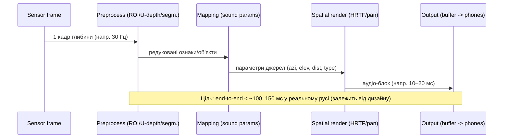

# Соніфікація карти глибин для незрячих: наукові результати, прототипи, алгоритми та рекомендації

## Виконавчий підсумок

Соніфікація карти глибин (depth map / RGB‑D) у «звукову панораму» — активний напрям сенсорної субституції, де 3D‑структура сцени кодується параметрами звуку (панорама/просторовість, гучність, висота тону, тембр, ритм, реверберація) для навігації та просторового розуміння у людей з порушеннями зору. Ранній пласт робіт показав: «піксель‑до‑звуку» маппінги на кшталт решіток/«рецептивних полів» можуть навчатися за хвилини–десятки хвилин і давати вимірювані покращення у проходженні маршрутів, але часто мають вузький робочий діапазон і помітне когнітивне навантаження. citeturn6view0turn8view0turn9view8turn13view0  
Нова хвиля систем зміщується від «сирої» карти глибин до більш семантичних або контекстних підказок (стіни, напрям коридору, отвори/повороти, перешкоди) та/або інтерактивної соніфікації (користувач запитує підмножину сцени), що зменшує сенсорне перевантаження. citeturn10view0turn10view2turn36view2turn5view6  
З погляду real‑time практики, опубліковані прототипи часто тримаються в порядку ~70–130 мс на конверсію/оновлення звуку та працюють у діапазоні 7.5–30 Гц оновлення (залежно від дизайну), що є досяжним на ноутбуках/смартфонах, але потребує дисципліни щодо буферів аудіо та фільтрації/стабілізації сигналу. citeturn10view0turn6view2turn9view8  
Серед параметрів кодування відстані «частота тону» та «частота повторення біпів» у контрольованих експериментах показують добру точність оцінки глибини, а «частота повторення біпів» — кращу запам’ятовуваність; водночас просторові підказки по азимуту часто даються через panning або HRTF. citeturn9view9turn9view10turn36view2turn11view3  
Практична рекомендація з огляду на літературу: стартувати з низьковартісної архітектури «глибина → редукція → 9–32 секторів → просторові/панорамні сигнали», додати інтерактивний «зум/ROI» та персоналізацію (вибір тембрів, діапазонів глибини, пріоритетів), а оцінку будувати на комбінації (1) поведінкових метрик (час/зіткнення/помилки), (2) метрик навчуваності (час до стабільної продуктивності), (3) суб’єктивних шкал (SUS, навантаження, комфорт). citeturn36view3turn30view2turn5view6turn13view1  

## Постановка задачі та межі огляду

У цьому огляді «соніфікація карти глибин» означає перетворення оцінки відстані до поверхонь/об’єктів (з RGB‑D камери, стерео/ToF або ML‑оцінки глибини) на безперервну або квазі‑безперервну звукову «картину» (soundscape), яку користувач може інтерпретувати для уникнення перешкод, орієнтації у коридорах/кімнатах та локалізації об’єктів. citeturn6view4turn11view3turn36view1  

Важливе обмеження, що повторюється у роботах: низка популярних RGB‑D/активних ІЧ‑сенсорів орієнтована на «indoor‑first» сценарії (проблеми на прямому сонячному світлі, мінімальна робоча дистанція, артефакти на чорних/скляних поверхнях). Це прямо відмічають як обмеження для повсякденного використання (особливо outdoor). citeturn6view2turn6view4turn11view2turn36view1  

Окремо підкреслю: частина «peer‑reviewed» робіт використовує зрячих учасників із зав’язаними очима як першу перевірку; переносимість результатів на незрячих може бути неповною і часто визнається авторами як наступний крок. citeturn10view3turn9view2turn32view0  

## Наукові роботи та підтверджені результати

Нижче — компактна таблиця, яка суміщає «peer‑reviewed» публікації про соніфікацію глибини/карт глибин та найближчі до теми валідуючі дослідження (точність сприйняття глибини/просторові межі). У стовпчиках зазначено те, що найчастіше потрібне для інженерного проєктування; якщо параметр не опубліковано — позначено як **невизначено**.

| Робота | Рік | Автори/організація | Вхід (сенсор/дані) | Маппінг у звук (ядро) | Latency / темп оновлення | Оцінка/висновки | Код/відкритість |
|---|---:|---|---|---|---|---|---|
| «Navigating from a Depth Image Converted into Sound» / система MeloSee | 2015 | entity["people","Chloé Stoll","author 2015"] та ін.; entity["organization","University Grenoble Alpes","university france"] | RGB‑D (Asus Xtion, «Kinect‑тип») | 64 «рецептивні поля»: **висота**→pitch (октава), **азимут**→stereo gain, **дистанція**→гучність | Аудіо‑оновлення 7.5 Гц (~132 мс); робочий діапазон 0.5–2.5 м (експериментально) | 21 учасник із пов’язкою; <8 хв знайомства; покращення часу та помилок між сесіями (навчання), dual‑task можливий citeturn6view2turn8view0turn7view0 | Невизначено |
| «Depth – Melody Substitution» | 2012 | entity["people","Vincent Fristot","author 2012"] та ін.; entity["organization","GIPSA-Lab","research lab grenoble"] | entity["company","Microsoft","tech company"] Kinect depth (VGA 640×480, 30 Гц) | 64 RF: **вертикаль**→частота (музична шкала), **горизонталь**→ILD (gain L/R), **глибина**→інтенсивність; квант. глибини на рівні | Виміряна загальна затримка ~100 мс; ASIO‑буфер давав ~2 мс залежно від буфера citeturn9view8turn9view7 | Претест зі зрячими: «швидке занурення», але потрібні кращі експерименти (автори) citeturn9view7turn9view8 | Невизначено |
| «Auditory Augmented Reality: Object Sonification for the Visually Impaired» | 2012 | entity["people","Flávio Ribeiro","author 2012"] та ін.; entity["organization","Microsoft Research","research division"] | Kinect RGB‑D 640×480 + IMU | CV‑виділення площин/плану/облич + **HRTF‑просторове аудіо**: «кліки» для навігації, ноти/послідовності для площин; head‑tracking | HRTF‑фільтрація типово ~10 мс (FFT‑конволюція); рендер сцени ~1 с із head‑tracking citeturn11view1turn11view3turn11view4 | Підхід «high‑level features → spatial audio» зменшує потребу в явному кодуванні координат; враховано проблеми HRTF mismatch citeturn11view3turn11view2 | Невизначено |
| «Supporting Blind Navigation using Depth Sensing and Sonification» | 2013 | entity["people","Michael Brock","hci author 2013"] та ін.; entity["organization","University of St Andrews","university scotland"] | Kinect depth | Downsample 640×480 → 20×15; obstacle detection; **x→panning, y→pitch, z→volume**; синтез у SuperCollider | Невизначено | 8 зрячих із пов’язкою + 1 незрячий; навчання «за кілька хвилин»; мало зіткнень; для незрячого міряли час і NASA‑TLX (комбінація з тростиною) citeturn12view3turn13view0turn13view1 | Невизначено |
| «Improving Indoor Mobility … with Depth‑Based Spatial Sound» | 2015 | entity["people","Simon Blessenohl","author 2015"] та ін.; entity["organization","Microsoft Research","research division"] | Head‑mounted depth camera (прототип) | Контекстні cues: **стіни** (sinusoid + ампліт.), **vanishing point** (локаліз. низька нота), **openings**, **stop‑voice**, тощо + просторовий движок | ≈15 fps; depth→sound <70 мс (неоптимізовано) citeturn10view0turn9view0 | Пілот: 10 зрячих; порівняння з MeloSee — без значущих різниць у часі/безпеці через низький N, але краща помітність малих перешкод/корисність контекстних cue citeturn10view3turn9view2turn10view4 | Невизначено |
| «Blind wayfinding with physically‑based liquid sounds» (IJHCS; доступний preprint) | 2018 | entity["people","Simone Spagnol","author 2018"] та ін.; entity["organization","University of Iceland","university iceland"] | Сира depth map (поділ на сектори) | **Модельно‑керована соніфікація**: статистики глибини → параметри фізично‑обґрунтованої моделі «рідина/бульбашки»; HRTF‑просторовість; real‑time | Ціль — мінімальна затримка (якісно); чисельно — невизначено citeturn23view1turn21view0 | 14 зрячих із пов’язкою; у wayfinding завданні: 107/140 пройдених сцен для «fluid flow» vs 77/140 для vOICe; краща точність уникнення, краща приємність, менше втоми citeturn23view2turn23view3turn21view0 | Компонент генератора згадано як частина open‑source SDT (Sound Design Toolkit) citeturn21view0 |
| «Interactive sonification of U‑depth images …» | 2019 | entity["people","Piotr Skulimowski","author 2019"] та ін.; entity["organization","Lodz University of Technology","university poland"] | Occipital Structure Sensor (IR structured light): 640×480 @ 30 fps; range 40–500 см | **U‑depth гістограми** + інтерактивний вибір області; **x→stereo panning**, **дистанція→частота** (N=10, 400–4000 Гц), амплітуда/розмір; цикли 50–96 мс | Sonification cycle 50 мс (інтерактивний режим), 96 мс (proximity режим) citeturn36view2turn35view1 | 3 користувачі з вадами зору; successful indoor mobility tasks; SUS і task‑опитники; 10 хв інструктажу часто достатньо citeturn36view3turn33view1turn34view0 | Open‑access paper; код системи — невизначено |
| «A Comparative Study in Real‑Time Scene Sonification…» | 2020 | entity["people","W. Hu","author 2020"] та ін. | Глибина (raw), obstacle‑рівень, path‑рівень | Порівняння 3 підходів: depth image sonification vs obstacle sonification vs path sonification | Невизначено | 12 VIP; час проходження близький між методами й тростиною; зате у соніфікації більше «failures», і різні користувачі віддають перевагу різним стилям; детально вимірювали час навчання та 5‑пункт опитник (scene/navigation/complexity/comfort/overall) citeturn5view6turn37view2 | Невизначено |
| «Evaluation of short range depth sonifications…» | 2023 | entity["people","Louis Commère","author 2023"]; entity["people","Jean Rouat","researcher 2023"] | 3D‑сенсор (коротка дистанція до 1 м у протоколі) | Порівняння 5 кодувань глибини: **Amp**, **BRR (beep repetition)**, **Freq**, **Reverb**, **SNR** | Невизначено | 28 зрячих із пов’язкою; найкраща точність: Freq і BRR; найкраща «запам’ятовуваність» у ретеншені — BRR citeturn9view9turn9view10 | arXiv (передпублікація) |
| «SoundSight: a mobile sensory substitution device…» | 2022 | entity["people","Giles Hamilton-Fletcher","author 2022"] та ін. | iPhone RGB / RGB‑D (dual lens/LiDAR), Occipital Structure Sensor, FLIR One | Масштабована «матриця звуків»: **HRTF‑горизонт**, **вертикаль→лог‑частота**, **глибина→гучність**; вибір тембрів (pure‑tones/banjo/rainfall тощо) + кастомізація | «Без відчутного лагу» (якісно); чисельно — невизначено citeturn30view2turn30view1 | End‑user testing: N=3 повністю незрячі + N=4 слабкозорі; порівнювали ясність/залученість/розслабленість/відволікання; різні тембри оптимальні для різних критеріїв citeturn30view2turn30view1 | Є публічний репозиторій iOS‑коду citeturn24view3turn27view0 |
| «How Much Spatial Information Is Lost…» (порівняння модальностей на одній depth‑решітці) | 2019 | entity["people","Mike Richardson","hci researcher 2019"] та ін. | Structure Sensor depth 16×8 → (візуально/аудіо/хаптик) | Аудіо: grey‑noise + HRTF; **глибина→гучність**; small timing offset L/R; порівняння з VibroVision (хаптика) і візуальним доступом до depth | Невизначено | N=22; для аудіо: середня дискримінація глибини ≈8.25 см, вертикалі ≈30.08 см; аудіо значно краще за хаптик у глибині, але гірше за «візуальну межу» citeturn32view3turn32view1turn32view2 | Невизначено |

**Шаблон розширеної порівняльної таблиці (яку зазвичай просять на етапі планування експериментів):** `method family` (pixel/grid vs object/semantic vs model‑based), `audio params` (freq/amp/pan/timbre/HRTF/rhythm/reverb), `sensor` (RGB‑D/ToF/stereo/ML depth), `refresh/latency`, `evaluation` (N, tasks, metrics), `code openness` (repo/license).  

## Прототипи, системи та відкриті реалізації

Поза «класичними» академічними прототипами, є кілька публічних систем і репозиторіїв, що корисні як інженерні референси.

entity["organization","SoundSight","mobile ssd app"] — мобільна платформа для соніфікації depth/кольору/тепла з високою кастомізацією: підтримує iPhone RGB‑D (dual lens/LiDAR), зовнішній Occipital Structure Sensor (через SDK) та FLIR One; використовує HRTF‑просторовість по горизонталі, вертикаль кодує логарифмічними змінами частоти, а глибину — гучністю; має опубліковані результати попереднього тестування з незрячими/слабкозорими та публічний iOS‑репозиторій. citeturn30view0turn30view2turn24view3  

entity["organization","Synaestheatre","depth to spatial audio"] — система (похідна/попередник підходів SoundSight) з depth‑сенсором Structure Sensor, де depth‑матриця (16×8 у досліді) перетворюється на просторові аудіо‑джерела (grey‑noise + HRTF), а відстань — на гучність; важлива тим, що дає «вимірювану межу» просторової точності при однаковій роздільності даних і різних модальностях виходу. citeturn32view1turn32view3turn31view0  

entity["organization","QuidEst","monocular depth to audio"] — low‑cost орієнтований прототип: оцінює монокулярну глибину через MiDaS (ONNX) і перетворює 9 областей кадру на «згасаючі ноти» зі стерео‑розкладкою ліво/центр/право; відкрито вказано репозиторій із бінарниками/кодом, а також описано аудіо‑поточність (оновлення ~20 мс) та fade‑in/out для уникнення «клацань». citeturn26view0turn26view2turn26view3turn25view2  

entity["organization","MeloSee","depth melody ssd"] — дослідницький прототип «depth → melody» із решіткою «рецептивних полів» та простим маппінгом (pitch/панорама/гучність), де показано ефект навчання (коротко‑ і довгостроковий) та можливість dual‑task. citeturn6view0turn7view0turn8view0  

entity["organization","Sound of Vision","assistive travel aid project"] — у відкритих описах позиціонується як SSD із комп’ютерним зором та «натуралістичним» аудіо+хаптик‑кодуванням середовища (втім, деталізація компонентів/коду залежить від конкретних публікацій консорціуму; частина матеріалів може бути фрагментарною у відкритому доступі). citeturn4search25turn22view0  

image_group{"layout":"carousel","aspect_ratio":"16:9","query":["MeloSee depth image converted into sound setup","Microsoft Kinect depth camera for navigation aid blind","Occipital Structure Sensor mounted on VR headset Synaestheatre","SoundSight sensory substitution app depth sonification"],"num_per_query":1}

## Алгоритмічні підходи: як будують «звукову панораму» з глибини

### Узагальнена таксономія підходів

**Параметричний маппінг «пікселі/сектори → звук» (low‑level).**  
Типовий патерн: розбити depth‑карту на решітку (8×8, 16×8, 20×15, 3×5 тощо) і незалежно кодувати кожен елемент/сектор. Приклади: MeloSee (64 RF) citeturn6view0turn6view2, Depth‑Melody substitution (64 RF + ILD) citeturn9view8turn9view7, Brock&Kristensson (20×15 + x/y/z→pan/pitch/vol) citeturn13view0turn13view1, QuidEst (9 секторів + ноти + стерео) citeturn26view2turn26view3.  
Плюс: простота, real‑time. Мінус: ризик сенсорного/когнітивного перевантаження, особливо якщо «все звучить завжди». Це прямо підсвічено у дискусіях порівнянь зі «контекстними» cue. citeturn10view4turn23view3  

**Контекстні/семантичні cue (high‑level).**  
Замість перетворювати всю карту, система виділяє структури (стіни/підлога/отвор/маршрут) і генерує невелику кількість «осмислених» звуків. Blessenohl et al. роблять cue для стін, vanishing point, поворотів/отворів та небезпек, використовуючи просторовий движок і обмежуючи звук порогами відстані. citeturn10view0turn10view2  
Ribeiro et al. поєднують CV‑моделі (площини, floorplan) із HRTF‑рендерингом і впорядкованими «кліками» для азимутального сканування. citeturn11view2turn11view3turn11view4  
Hu et al. прямо порівняли «raw depth» проти «obstacle» і «path» соніфікації та показали відмінності у навчуваності/детальності сцени. citeturn5view6turn37view2  

**Інтерактивна соніфікація (user‑in‑the‑loop).**  
У Skulimowski et al. користувач торкається екрану, щоб «запитати» частину U‑depth карти; це знижує темп подачі інформації та дає контроль над широкосмуговим каналом «слух». citeturn36view2turn36view3  

**Модельно‑керована/перцептивно‑орієнтована соніфікація (model‑based).**  
Spagnol et al. показують, що фізично‑правдоподібні «рідини/бульбашки» можуть бути помітно приємнішими і водночас ефективними (в їх wayfinding експерименті — вища ймовірність проходження сцен, ніж у vOICe після короткого тренування). citeturn23view2turn23view3turn23view1  

### Архітектура системи та бюджет затримок

```mermaid
flowchart LR
  A[Сенсор глибини / RGB-D / Stereo / ML depth] --> B[Синхронізація + фільтрація]
  B --> C[Редукція даних: ROI / сектори / U-depth / детектор перешкод]
  C --> D[Перетворення в "звукові об'єкти"]
  D --> E[Просторовий рендер: панорама або HRTF]
  E --> F[Аудіо-буфер + вихід (відкриті навушники)]
  C --> G[UI/жести/кнопка "запитати відстань"]
  G --> C
```

Реалістичний таймлайн (приклад) можна будувати, опираючись на публікації, які прямо вимірювали окремі компоненти: конверсія depth→sound <70 мс при ~15 fps у Blessenohl et al. citeturn10view0; аудіо‑оновлення ~132 мс у MeloSee citeturn6view2; загальна затримка ~100 мс у Depth‑Melody substitution citeturn9view8; HRTF‑конволюція ~10 мс у Ribeiro et al. citeturn11view1  



### Рекомендовані алгоритми для трьох рівнів складності

#### Простий рівень (realtime, low‑cost, мінімальна сенсорика)

Ідея: секторизація + три параметри (панорама, гучність, базова висота/тембр). Аналогічний дух мають QuidEst (9 секторів) citeturn26view2turn26view3 та ранні grid‑маппінги. citeturn13view0turn9view8  

```text
Input: depth_map D (H×W), update_rate ~10–30 Hz
Params: near_thresh, far_thresh, grid = 3×3 або 4×4
For each frame:
  1) Clamp depth to [near_thresh, far_thresh]; ignore invalid.
  2) For each grid cell c:
       d_c = percentile(D in cell, 10%)      # "найближче" в секторі
       if d_c is invalid: mute c
       else:
         pan = map_x(cell_center_x)          # L/R
         amp = map_depth_to_amp(d_c)         # ближче => голосніше
         pitch_or_timbre = map_y_or_band(cell_center_y)
         emit short tone/noise with (pan, amp, pitch_or_timbre) with fade-in/out
  3) Limit total simultaneous sounds (top-K nearest cells) to reduce masking.
```

#### Середній рівень (краще розрізнення глибини, просторове аудіо, інтерактивність)

Ідея: редукція U‑depth/гістограми + інтерактивний ROI + чітко визначені цикли оновлення звуку (50–100 мс), як у Skulimowski et al. citeturn36view2turn35view1 і з HRTF/просторовістю, як у Ribeiro та SoundSight. citeturn11view4turn30view2  

```text
Input: depth_map D; UI gives ROI_x (column) or ROI_box; N_bins=10
Precompute: freq bins f[i] from 400..4000 Hz; cycle_T=5 ms (=> 50 ms per sweep)

Loop:
  1) Build U-depth (or per-ROI depth histogram along x) with max_depth=5 m.
  2) If user touches screen:
       focus = ROI (interactive mode)
     else:
       focus = full map (proximity mode, only z<1.5 m)
  3) For each depth bin i:
       a[i] = normalized_energy(bin i in focus)   # size/occupancy
       pan_x = map_x(ROI_x or segment index)
       Render packet: sin(2π f[i] t) * a[i] with stereo pan (or HRTF azimuth)
  4) Add "verbal distance probe" on demand (TTS) for calibration (optional).
```

#### Просунутий рівень (ML/NN + адаптивне навчання користувача)

Ідея: ML дає depth (як MiDaS у QuidEst) citeturn25view2 або семантику/площини; поверх цього — адаптивний вибір параметрів соніфікації та/або «модельно‑керовані» звуки (фізичні/натуралістичні) для зниження втоми (як у «liquid sounds»). citeturn23view1turn23view3  

```text
Input: RGB stream (camera) + optional IMU
Modules:
  DepthNet: monocular depth (fast), confidence map
  SceneFilter: selects salient hazards (nearest obstacle clusters, floor discontinuities)
  SonificationPolicy: chooses mapping mode per context (BRR vs Freq vs model-based)
  Personalization: updates parameters from user feedback (short ratings / success metrics)

Loop:
  1) depth, conf = DepthNet(RGB)
  2) hazards = cluster_near_regions(depth, conf, grid=K sectors)
  3) context = estimate_context(hazards, motion, corridor-like geometry)
  4) policy = SonificationPolicy(context, user_profile)
       - If fast approaching hazard: BRR beeps (memorability)  # узгоджено з порівняннями
       - If fine depth estimation needed: Freq coding
       - If long sessions: model-based pleasant soundscape
  5) render spatial audio objects + minimal speech for critical states
  6) Update user_profile from implicit signals:
       - collisions/errors, time-to-pass, manual "too noisy" toggle
       - occasional 3–5 point quick rating
```

## Оцінювання: критерії якості та метрики

**Зрозумілість/інтерпретованість (comprehension).**  
Вимірюється або в задачах локалізації (оцінка, який об’єкт ближче/вище), або у проходженні «сцен» без помилок. Приклад: у порівнянні модальностей на однаковій depth‑решітці 16×8 аудіо дає середню дискримінацію глибини ~8.25 см (краще за хаптик), але значно гірше за «візуальний доступ» до depth. citeturn32view3turn32view2  
У Spagnol et al. ключовою метрикою була «кількість пройдених сцен» (passed scenes) та навігаційні помилки, де модель «fluid flow» перевищила vOICe після короткого тренування. citeturn23view2turn23view3  

**Навчуваність і ретеншн (learnability).**  
Stoll et al. показують ефект навчання в межах сесії та між двома сесіями, розділеними тижнем, використовуючи час та помилки як залежні змінні. citeturn7view0turn7view2turn8view0  
Commère & Rouat формалізують «короткотермінове навчання» та «утримання після паузи» і показують відмінності між кодуваннями (BRR легше запам’ятати). citeturn9view9turn9view10  
Hu et al. прямо вимірюють «час навчання/адаптації» для різних методів соніфікації. citeturn37view2turn5view6  

**Швидкість і безпека навігації.**  
Типові метрики: completion time, collisions/contacts, U‑turns/втрата напрямку, «interventions» експериментатора. citeturn7view2turn9view2turn13view1turn37view2  
У Hu et al. час проходження соніфікаційних методів статистично не відрізнявся від тростини на їх протоколі, але кількість failure‑випадків у соніфікації була вищою. citeturn37view2turn5view6  

**Когнітивне навантаження та комфорт.**  
Використовуються NASA‑TLX або близькі шкали (приклад — Brock&Kristensson для незрячого учасника). citeturn13view1turn12view1  
Системи на кшталт Skulimowski et al. застосовують SUS (0–100) для системної оцінки юзабіліті. citeturn36view3turn36view3  
SoundSight тестує суб’єктивні виміри «clear/engaging/relaxing/distracting» і показує, що тембр є важелем компромісу між ясністю та не‑втомою. citeturn30view2turn30view1  

## Практичні рекомендації для розробки прототипу

Нижче — рекомендації, які найбільш прямо випливають з описаних прототипів і їхніх вимірювань.

**Вхідні дані та сенсор.**  
Якщо ви орієнтуєтесь на indoor‑навігацію, RGB‑D/структуроване світло (Structure Sensor, «Kinect‑тип») широко використані в наукових роботах; типові режими — 640×480 @ 30 fps. citeturn36view1turn11view0turn9view7  
Для outdoor або змішаних умов варто прямо планувати стратегії деградації/детекції «поганих кадрів», бо активні ІЧ‑сенсори можуть «сліпнути» на сонці, а також давати проблеми на склі/чорних поверхнях. citeturn36view1turn11view2turn6view4  
Як low‑cost альтернативу можна розглядати монокулярну оцінку глибини (MiDaS‑подібні моделі), але її надійність і калібрування «метрів» треба перевіряти окремо (QuidEst у публікації трактує це як систему попередження, а не точну 3D‑реконструкцію). citeturn25view2turn26view3  

**Latency та аудіо‑пайплайн.**  
Орієнтуйтесь на end‑to‑end бюджет порядку **~100–150 мс** для динамічної ходьби як практичну верхню межу: цього порядку величини досягають прототипи з вимірюваннями (≈70 мс depth→sound у Blessenohl; ≈100 мс загалом у Depth‑Melody; ≈132 мс аудіо‑оновлення у MeloSee). citeturn10view0turn9view8turn6view2  
Критично: fade‑in/fade‑out та контроль аудіо‑буфера, інакше користувач чутиме «клацання» при появі/зникненні джерел (це прямо враховано в QuidEst). citeturn26view3turn25view2  

**Маппінг‑стратегія (що саме кодувати).**  
Для першого прототипу найменш ризикований шлях — **обмежена кількість секторів + пріоритезація ближніх небезпек**, а не «вся карта завжди». Це зменшує ефект звикання до постійного шуму й ризик «пропустити» небезпечне зближення зі стіною. citeturn10view4turn10view0  
Якщо потрібна «панорамність», просторові підказки по азимуту доцільно робити через panning або HRTF; але HRTF‑mismatch існує, тому корисні «синхро‑кліки/референси» та/або калібрування (як у Ribeiro). citeturn11view3turn11view1  
Для кодування **відстані** в короткому діапазоні варто протестувати мінімум два варіанти: `pitch` та `beep repetition rate` — вони показують сильні результати у контрольованому порівнянні, але різні профілі навчання/запам’ятовування. citeturn9view9turn9view10  

**UI/UX для незрячих.**  
Інтерактивність (ROI, «зум», перемикання режимів) — один із найсильніших інженерних важелів, бо дозволяє керувати «пропускною здатністю» слуху. Skulimowski показує touch‑жести для вибору області та окремі режими (interactive/proximity/verbal), а SoundSight — широку кастомізацію режимів і сенсорів. citeturn36view2turn36view3turn30view1turn30view2  
На практиці корисно мати «режим короткої небезпеки» (тільки z < 1–1.5 м) як постійний фон + «режим дослідження» на запит, що близько до дизайну Skulimowski (proximity vs interactive). citeturn35view4turn36view2  

**Апаратні обмеження та носіння.**  
Багато робіт підкреслюють, що система не повинна маскувати природні звуки; це аргумент на користь відкритих навушників і мінімалістичних cue. citeturn10view0turn11view4  
Також важлива «активна сенсорика» (рухи голови): і MeloSee, і «fluid flow» підкреслюють роль head‑scanning та проблеми «scan‑within‑scan» у скануючих алгоритмах на кшталт vOICe‑стилю. citeturn7view0turn23view3  

**Які діаграми/онлайн‑зображення варто додати у ваш прототип‑репорт**  
Доцільний набір ілюстрацій (як пошукові запити для включення у документацію/статтю):  
- «depth map grid sonification (8x8) example» (для пояснення секторизації, на кшталт MeloSee / Depth‑Melody) citeturn6view2turn9view8  
- «U-depth map histogram visualization» (для пояснення U‑depth, як у Skulimowski) citeturn36view0turn36view2  
- «spatial audio HRTF schematic» (для блоку просторового рендеру, як у Ribeiro/SoundSight) citeturn11view1turn30view2  
- «vanishing point cue corridor assistive audio» (для контекстного cue‑підходу Blessenohl) citeturn10view2  
- «physically based liquid sound model bubbles sonification» (для модельно‑керованого soundscape) citeturn23view1turn23view3  

## Ключові джерела

- Stoll et al., 2015 (MeloSee, Applied Bionics and Biomechanics; open на PMC): формальний опис grid‑маппінгу та експериментальні докази навчання/dual‑task. citeturn8view0turn7view2turn6view2  
- Fristot et al., 2012 (EUSIPCO): рання «depth→melody» система з виміряними затримками та деталями маппінгу. citeturn9view7turn9view8  
- Ribeiro et al., 2012 (IEEE MMSP / Microsoft Research PDF): приклад high‑level CV→spatial audio, HRTF‑конволюція та «клік‑скан». citeturn11view3turn11view1turn9view4  
- Brock & Kristensson, 2013 (UbiComp Adjunct): компактний прототип x/y/z→панорама/висота/гучність + дані NASA‑TLX. citeturn13view0turn13view1turn9view5  
- Blessenohl et al., 2015 (ICCV Workshop): контекстні cues + оцінка й вимір depth→sound часу. citeturn10view0turn10view3turn9view2  
- Spagnol et al., 2018 (IJHCS; open preprint): модельно‑керована соніфікація «liquid sounds», значущі покращення проти vOICe та якісні коментарі про втому/сканування. citeturn23view2turn23view3turn23view1  
- Skulimowski et al., 2019 (Journal on Multimodal User Interfaces, open access): U‑depth + інтерактивність, конкретні параметри частот/циклів, SUS‑оцінка з VIP. citeturn36view2turn36view3turn35view1  
- Hu et al., 2020 (Sensors, MDPI): порівняння raw/obstacle/path соніфікації на 12 VIP + питання комфорту/складності. citeturn5view6turn37view2  
- Commère & Rouat, 2023 (arXiv): контрольоване порівняння «параметрів глибини» (Amp/BRR/Freq/Reverb/SNR) і рекомендації по вибору кодування. citeturn9view9turn9view10  
- Hamilton‑Fletcher et al., 2022 (SoundSight, Springer PDF) + GitHub репозиторій: масштабована кастомізація сенсорів і тембрів, тестування з незрячими/слабкозорими, приклад інженерної реалізації. citeturn30view0turn30view2turn24view3  
- Richardson et al., 2019 (Synaestheatre vs VibroVision vs visual depth): кількісні межі дискримінації глибини/вертикалі при фіксованій depth‑роздільності. citeturn32view3turn32view1turn32view2